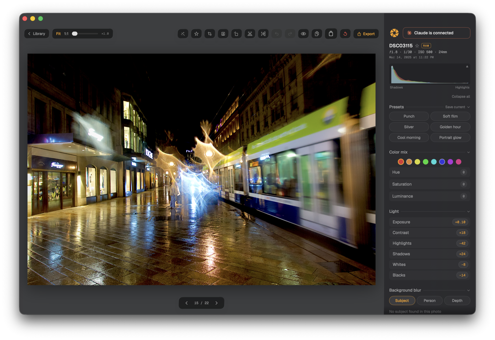
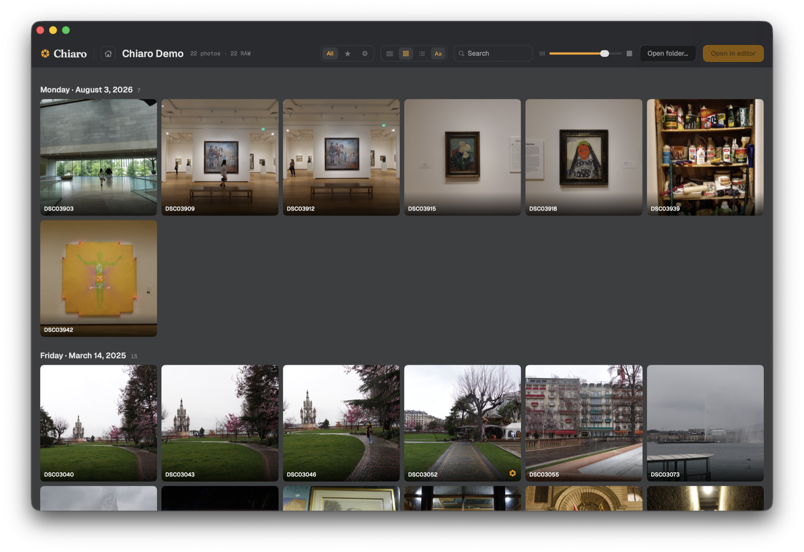
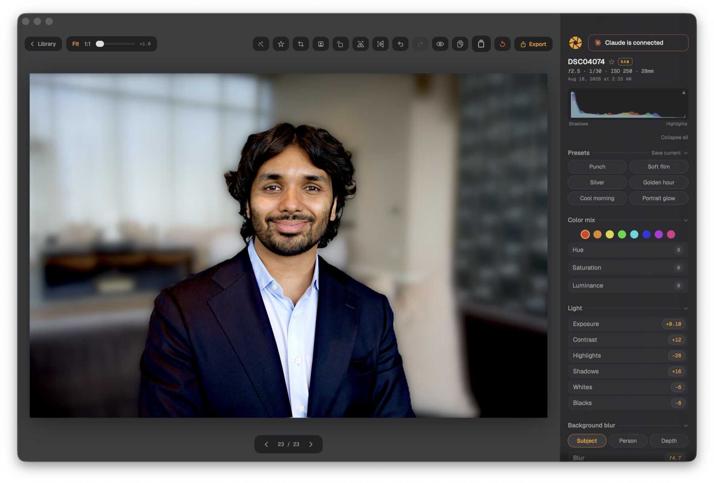
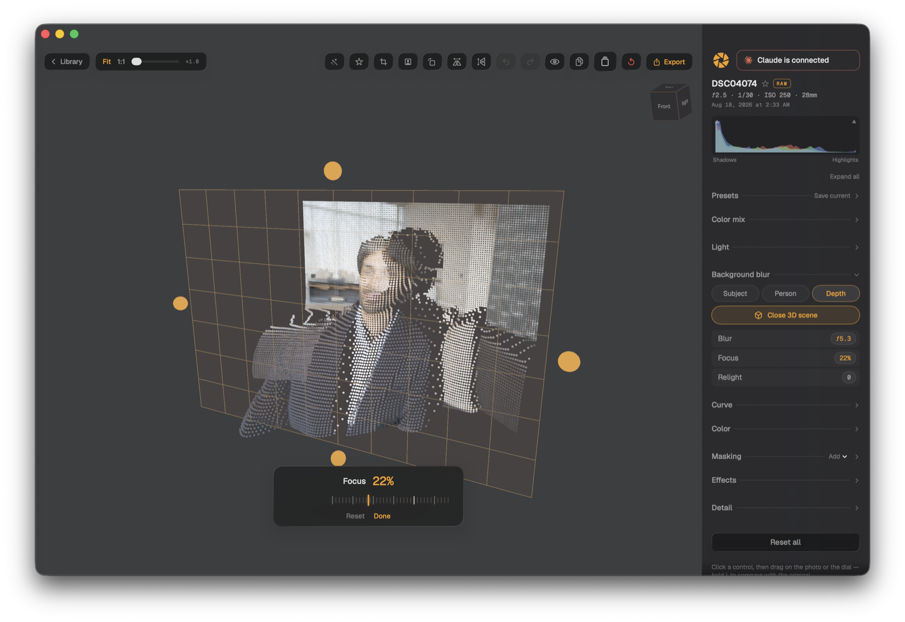
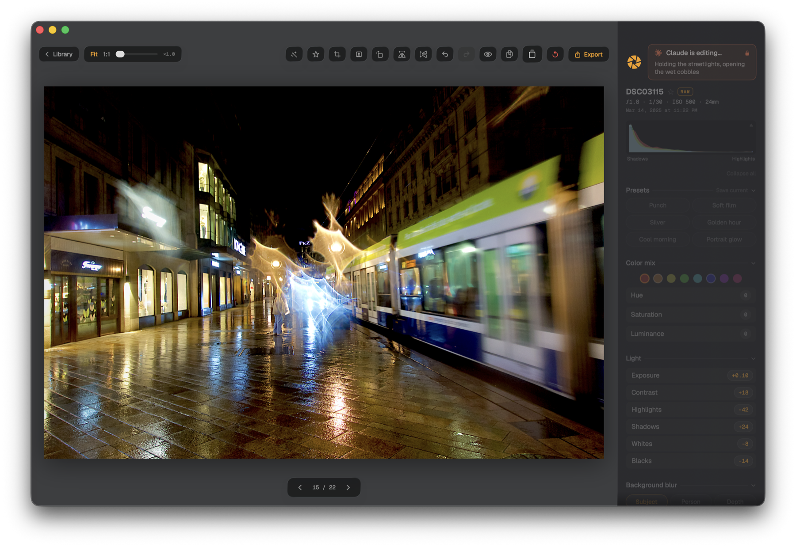

# Chiaro

A native macOS RAW photo editor. Dark, glassy, fast. Full-quality RAW editing
with no subscription, and an MCP server built in so the coding agent you already
run can edit alongside you.



Named for the light half of *chiaroscuro*: composing with light against dark.

- **Real RAW.** Apple's RAW engine decodes your files; every adjustment renders
  on the GPU through Core Image, live, at full resolution.
- **Non-destructive.** Edits live in small sidecar files next to your photos.
  Your originals are never written to, ever.
- **On-device intelligence.** Subject and person segmentation, monocular depth,
  and face-aware auto-tone all run locally. Nothing is uploaded.
- **Agent-native.** Chiaro serves MCP on localhost whenever it's running, so
  Claude Code, Codex, or any MCP client can read, edit, and export your photos
  while you watch.
- **Free and open source.** GPL-3.0. No account, no telemetry, no upsell.

Built around a Sony RX100 IV workflow, but camera-agnostic: anything on
[Apple's RAW-supported camera list](https://support.apple.com/en-us/102767) works.

## Install

Requires **macOS 26** or later on Apple silicon.

### Download

Grab `Chiaro-1.0.0.zip` from [the latest release](https://github.com/arjunphull123/chiaro/releases/latest),
unzip it, and drag `Chiaro.app` to your Applications folder.

**The first launch needs one extra step.** Chiaro is signed ad hoc rather than
with a paid Apple Developer certificate, so macOS quarantines it and refuses to
open it the first time. To let it through:

1. Double-click Chiaro. macOS says it "can't be opened because Apple cannot
   check it for malicious software". Click **Done**.
2. Open **System Settings → Privacy & Security**, scroll to the Security
   section, and click **Open Anyway** next to the message about Chiaro.
3. Confirm with **Open**.

You only do this once. (Control-clicking the app no longer bypasses this on
modern macOS; the Privacy & Security route is the one that works.)

Prefer the terminal? `xattr -d com.apple.quarantine /Applications/Chiaro.app`
does the same thing in one line.

### Homebrew

```
brew install --cask arjunphull123/tap/chiaro
```

Add `--no-quarantine` to skip the Privacy & Security step above.

### Build it yourself

```
git clone https://github.com/arjunphull123/chiaro.git
cd chiaro
swift run Chiaro                # debug build, straight to the app
scripts/bundle.sh               # release build → dist/Chiaro.app
```

## Editing

Open a folder of RAW files and Chiaro lays them out as a justified gallery,
a grid, or a sortable Finder-style list. Star the keepers, filter to them,
and press Return to edit.



- **Light and color:** exposure, contrast, highlights, shadows, whites, blacks,
  temperature, tint, vibrance, saturation, plus a tone curve and an eight-band
  color mixer
- **Color grading:** an independent tint for shadows, midtones, and highlights,
  each with its own strength and hue, and a balance control that moves the
  crossover between zones
- **Black and white:** a monochrome conversion weighted by the color mixer's
  luminance values, so darkening blue deepens a sky the way a red filter would
- **Detail:** clarity that sharpens or softens, sharpening, noise reduction,
  vignette, and film grain with its own coarseness control; RAW files add
  color-noise and moiré controls that reach into the decoder itself
- **Background blur:** real ƒ-stop-graded blur from Vision subject masks,
  person masks, or a monocular depth map with a movable focus plane you can
  inspect in a 3D scene
- **Local adjustments:** radial, linear, and subject masks, each with its own
  tonal controls and a luminance range that confines it to a band of tones,
  like the shadows inside a radial
- **Crop and straighten:** aspect presets, an arc ruler that follows your
  finger, and a one-click headshot crop that finds the face
- **Auto:** a single pass that sets exposure and contrast from the image
  statistics, weighted toward faces when it finds them; it leaves a RAW file's
  white balance alone
- **Presets:** six built in, plus anything you save
- **Export:** full-resolution JPEG, HEIF, or 16-bit TIFF



The depth map isn't a black box: open it as a 3D scene, orbit it, and drag the
focus plane through the point cloud to see exactly what's sharp and what isn't.



Adjustments are scrubbed directly on the photo: click a value, drag across the
image, and feel the detent when you cross neutral. Hold `\` to see the original.

## Your agent can edit too



Chiaro has no chat box and ships no API keys. Instead it serves
[MCP](https://modelcontextprotocol.io) over HTTP at `http://127.0.0.1:24242/mcp`
the whole time it's running, so whichever agent you already pay for (or don't)
can drive it. Agent edits render live in the window, the rail opens to whatever
sections were touched, and a pill in the corner shows you what the agent says
it's doing while soft-locking your own input so you two aren't fighting over the
same slider.

| Tool | What it does |
| --- | --- |
| `list_photos` | Everything in the open library, with starred and edited flags |
| `get_edit` | One photo's full adjustment state |
| `set_edit` | Change any adjustment; renders live, and requires an `intent` string shown in the UI |
| `get_stats` | Measured statistics of the rendered photo: luminance percentiles, per-channel clipping, a histogram |
| `apply_preset` / `list_presets` | Built-in and saved presets |
| `set_starred` | Flag keepers, the basis of agent-driven culling |
| `open_photo` | Bring a photo up in the editor so you can watch |
| `get_preview` | The photo rendered with its current edit, as a JPEG the agent can see |
| `export` | Write the finished file |

The server also teaches the craft: Chiaro serves its own editing skill over the
MCP prompts primitive, so any connecting agent can fetch the `chiaro-editing`
prompt and get the working method, every control's range and traps, and the
look recipes straight from the app. Nothing to install.

**Claude Code**: add Chiaro once, from anywhere:

```
claude mcp add --transport http --scope user chiaro http://127.0.0.1:24242/mcp
```

Then `claude` in whatever directory you keep your photos in can drive the app.
(This repo also ships a `.mcp.json` for anyone hacking on Chiaro itself, but you
don't need a clone to use it.)

**Codex CLI**: add the same HTTP server to your Codex MCP configuration. Codex
signs in with a ChatGPT account, including a free one, so this path costs
nothing beyond the time.

**Anything else**: Chiaro writes a discovery file to `~/.chiaro/mcp.json` on
launch, and the "Connect your agent" button in the app copies a ready-made
orientation prompt you can paste into any agent.

Because every adjustment is a plain value in one serializable model, an agent
can do things the UI doesn't have a button for: cull a shoot down to the frames
worth keeping, match a look across fifty photos, or measure the result with
`get_stats` and adjust until it lands.

## Where your edits live

Next to each photo, as a small sidecar file. Editing a photo never writes to the
RAW; deleting the sidecar restores the original exactly. Sidecars carry your
adjustments, the starred flag, and any named versions you save, and they decode
tolerantly: a sidecar from an older Chiaro opens fine in a newer one.

## How it's built

Swift and SwiftUI, `CIRAWFilter` for decode, Metal-backed Core Image for the
render pipeline, Vision and Core ML for segmentation and depth. No third-party
dependencies. The depth model (Depth Anything V2 Small, from Apple's Core ML
conversion) downloads on first use rather than shipping in the app.

The architectural decisions are written down in [`docs/adr/`](docs/adr/),
including the ones that didn't work out and got cut. [`docs/DESIGN.md`](docs/DESIGN.md)
covers the visual language, [`docs/ROADMAP.md`](docs/ROADMAP.md) covers what's next.

## License

GPL-3.0. See [LICENSE](LICENSE).

The bundled fonts (Fraunces, Archivo, Geist, and Geist Mono) are used under the SIL Open
Font License 1.1 and keep their own terms; see
[`Sources/Chiaro/Resources/Fonts/OFL.txt`](Sources/Chiaro/Resources/Fonts/OFL.txt).
Agent brand marks come from [Simple Icons](https://simpleicons.org) (CC0).

Issues are welcome. This is a personal project rather than a staffed one, so
pull requests may sit a while.
